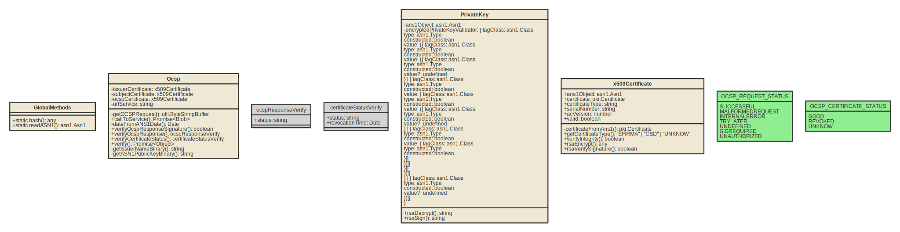

# e.firma 
Paquete para manejar firmas RSA con validación OCSP y verifación de autenticidad de certificados X509 

## Clases del proyecto

#### GlobalMethods
#### Ocsp
#### PrivateKey
#### x509Certificate

